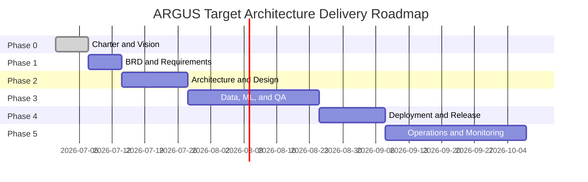

# ARGUS: Architecture Vision
## TOGAF ADM Phase A

## Document Control

| Field | Detail |
|---|---|
| **Document ID** | 01_Architecture_Vision |
| **Version** | 1.0 |
| **Status** | Approved |
| **Author** | Praveen Mittal |
| **Reviewer** | ARB |
| **Date Created** | 2026-06-30 |
| **Last Updated** | 2026-06-30 |

---

## 1. Purpose

This document establishes the high-level architecture vision for Project ARGUS. It defines the target-state architecture, key principles, strategic technology choices, and alignment to business goals. It serves as the baseline for all subsequent architecture work under TOGAF ADM Phases B, C, and D (Solution Architecture Document).

---

## 2. Business Context

### Problem
Document fraud is becoming increasingly sophisticated, driven by generative AI tooling that can produce near-undetectable forgeries. Existing rule-based and shallow ML systems cannot reliably generalise across the three attack vectors (physical manipulation, GenAI edits, recapture attacks).

### Opportunity
FREUID Challenge 2026 provides a structured evaluation dataset and benchmarking framework to develop, validate, and publish a production-grade detection system.

### Strategic Value
- Competitive differentiation through a state-of-the-art AI detection system
- Reusable ML and inference architecture applicable beyond the competition
- Enterprise compliance posture enabling deployment in regulated environments

---

## 3. Architecture Principles

| # | Principle | Rationale |
|---|---|---|
| P-01 | Reproducibility by default | Every training run must be traceable from raw data to model artifact |
| P-02 | Security and compliance by design | Controls are built-in, not retrofitted |
| P-03 | Modularity | Each pipeline stage is independently testable and replaceable |
| P-04 | Observability | Every system and model decision is measurable and traceable |
| P-05 | Reversibility | Every deployment must be rollback-capable within minutes |
| P-06 | Data minimisation | Only data required for inference is processed; PII is stripped at ingestion |
| P-07 | Human oversight | Low-confidence predictions trigger human review, never auto-approve |

---

## 4. Baseline Architecture (Current State)

There is no existing production system. The baseline state is:

- No deployed document fraud detection capability
- No ML training pipeline
- No inference service
- No monitoring or operational tooling
- Raw competition dataset available via Kaggle

---

## 5. Target Architecture (Future State)

### 5.1 System Overview

```
┌─────────────────────────────────────────────────────────────┐
│                        ARGUS SYSTEM                         │
│                                                             │
│  ┌──────────────┐    ┌──────────────┐    ┌──────────────┐  │
│  │  Data Layer  │───▶│  ML Layer    │───▶│  API Layer   │  │
│  └──────────────┘    └──────────────┘    └──────────────┘  │
│         │                   │                   │           │
│         ▼                   ▼                   ▼           │
│  ┌──────────────────────────────────────────────────────┐   │
│  │              MLOps / Observability Layer              │   │
│  └──────────────────────────────────────────────────────┘   │
└─────────────────────────────────────────────────────────────┘
```

### 5.2 Data Layer

| Component | Technology | Purpose |
|---|---|---|
| Ingestion | Python / Kaggle API | Pull and validate raw dataset |
| Preprocessing | OpenCV, Albumentations | Resize, normalise, EXIF strip |
| Augmentation | Albumentations | Training-time augmentation pipeline |
| Storage | Local / Cloud Object Store | Versioned datasets and splits |
| Versioning | DVC | Dataset and pipeline version control |

### 5.3 ML Layer

| Component | Technology | Purpose |
|---|---|---|
| Backbone 1 | EVA-02-Large | High-capacity texture and pattern extraction |
| Backbone 2 | ConvNeXt-V2-Base | Fine-grained visual feature extraction |
| Backbone 3 | EfficientNet-B4 | Lightweight, low-latency inference |
| Ensemble | Learned / Weighted | Combine predictions across backbones |
| Framework | PyTorch + timm | Model implementation and training |
| Config | Hydra | Reproducible experiment configuration |
| Experiment Tracking | MLflow / W&B | Metrics, artifacts, hyperparameters |
| Model Registry | MLflow | Versioned model promotion and lineage |

### 5.4 API Layer

| Component | Technology | Purpose |
|---|---|---|
| Inference API | FastAPI | REST endpoint for document fraud classification |
| Serving | Uvicorn + Gunicorn | ASGI production server |
| Container | Docker | Reproducible deployment unit |
| Orchestration | Kubernetes | Scalable deployment, health probes |
| API Gateway | NGINX / Cloud Gateway | TLS termination, routing, rate limiting |

### 5.5 MLOps and Observability Layer

| Component | Technology | Purpose |
|---|---|---|
| CI/CD | GitHub Actions | Automated quality gates and deployment |
| Infrastructure as Code | Terraform / Helm | Reproducible environment provisioning |
| Metrics | Prometheus + Grafana | System and model performance dashboards |
| Logging | Structured JSON → ELK / CloudWatch | Centralised log management |
| Alerting | Grafana Alerts / PagerDuty | Automated incident notification |
| Drift Detection | Evidently AI / custom | Input and prediction distribution monitoring |

---

## 6. Key Architecture Decisions (Summary)

Full ADRs to be documented in [docs/adr/](../adr/). Key preliminary decisions:

| Decision | Chosen Option | Rationale |
|---|---|---|
| Model framework | PyTorch + timm | Broad backbone support, active community |
| Serving framework | FastAPI | High performance, async, OpenAPI built-in |
| Experiment tracking | MLflow | Self-hostable, integrates with model registry |
| Dataset versioning | DVC | Git-native, supports remote storage |
| Config management | Hydra | Composable, supports multi-run sweeps |
| Container platform | Docker + Kubernetes | Industry standard, portable |
| CI/CD platform | GitHub Actions | Co-located with source code |

---

## 7. Non-Functional Requirements (High Level)

| Category | Requirement |
|---|---|
| Latency | p95 inference latency < 800 ms per document |
| Throughput | Minimum 100 requests per minute in production |
| Availability | 99.5% uptime in production |
| Scalability | Horizontal scaling via Kubernetes HPA |
| Security | TLS everywhere, RBAC, secrets management, image signing |
| Compliance | EU AI Act (High-Risk), GDPR, ISO/IEC 42001 |
| Explainability | Confidence score and attention map returned with each prediction |

---

## 8. Compliance Alignment

| Regulation | Implication for ARGUS |
|---|---|
| **EU AI Act** | ARGUS is a high-risk AI system. Requires risk management system, technical documentation, human oversight, accuracy and robustness controls, and logging |
| **GDPR** | No PII storage; EXIF stripped at ingestion; data minimisation; processing lawfulness documented |
| **ISO/IEC 42001** | AI management system controls required; documented in [08_Security_Compliance.md](../Phase-4/08_Security_Compliance.md) |

---

## 9. Roadmap Alignment



---

## 10. Risks and Assumptions

### Architecture-Level Risks

| Risk | Mitigation |
|---|---|
| EVA-02-Large may exceed inference latency budget | EfficientNet-B4 provides a latency fallback; ensemble weighting is tunable |
| Drift detection tooling not available at production launch | Manual statistical monitoring as interim; Evidently AI integration in Phase 5 |
| Kubernetes cluster costs exceed budget | Evaluate serverless container hosting as an alternative |

### Architecture Assumptions

| Assumption |
|---|
| Pre-trained weights for all three backbones are publicly available |
| The FREUID dataset covers all three fraud attack types in training and evaluation splits |
| The production API will receive single-document requests, not batch streams |

---

## 11. Sign-Off

By signing below, the ARB confirms this Architecture Vision is approved as the baseline for Phase B onwards.

| Name | Role | Signature | Date |
|---|---|---|---|
| Praveen Mittal | AI Solution Architect | Approved | 2026-07-02 |
| Dr. Arthur Pendelton | ARB Chair | Approved | 2026-07-02 |
| Victor Vance | Security Lead | Approved | 2026-07-02 |
| Elena Vance | Business Sponsor | Approved | 2026-07-02 |
