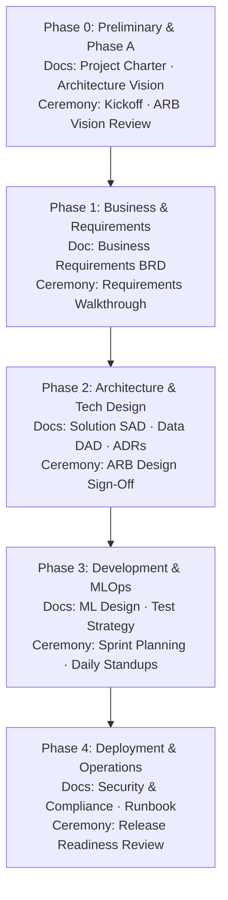

# ARGUS: Enterprise AI Project Runbook
## Step-by-Step Project Delivery Playbook (TOGAF ADM + Agile/Scrum + MLOps)

This runbook serves as the master execution playbook for **Project ARGUS** (Identity Document Fraud Detection). It details the end-to-end delivery lifecycle starting from absolute scratch. Every phase requires specific document deliverables and governance ceremonies before proceeding to the next.

---

## 1. Project Lifecycle & Document Roadmap

To ensure enterprise-grade compliance (ISO/IEC 42001, EU AI Act, GDPR) and architectural alignment (TOGAF), the project follows a strict sequential document and ceremony roadmap:

---

## 2. Phase-by-Phase Execution Guide

---

### Phase 0: Preliminary & Phase A (Architecture Vision)

*   **Objective**: Define the project scope, identify stakeholders, and establish the high-level architecture vision.
*   **Input**: Initial competition guidelines, business opportunity brief.
*   **Activities**:
    *   Conduct the **Project Kickoff Ceremony** with all stakeholders.
    *   Draft the **Project Charter** and **Architecture Vision**.
*   **Deliverables**:
    *   `docs/00_Project_Charter.md`: Project scope, constraints, and business case.
    *   `docs/01_Architecture_Vision.md`: High-level baseline vs. target architecture.
*   **Ceremony**: **Architecture Review Board (ARB) Vision Review** — Formal sign-off on the scope and high-level vision.
*   **RACI**:
    *   *Accountable*: AI Solution Architect
    *   *Responsible*: AI Solution Architect, Project Manager
    *   *Consulted*: Business Sponsor, Security Lead
    *   *Informed*: Development Team
*   **Gate Criteria**:
    *   *Entry*: Project initiation authorized by sponsor.
    *   *Exit*: ARB approval of the Architecture Vision; signed Project Charter.

---

### Phase 1: Business & Requirements Definition

*   **Objective**: Translate the high-level vision into detailed functional, non-functional, and compliance requirements.
*   **Input**: Approved Architecture Vision.
*   **Activities**:
    *   Conduct **Requirement Gathering Workshops** with business and compliance teams.
    *   Define target operating metrics (APCER @ 1% BPCER, latency thresholds).
*   **Deliverables**:
    *   `docs/02_BRD.md`: Business Requirements Document.
    *   `docs/03_Use_Case_Specification.md`: Detailed user stories and failure modes.
*   **Ceremony**: **Requirements Walkthrough & Sign-Off** — Business and technical alignment meeting.
*   **RACI**:
    *   *Accountable*: Project Manager
    *   *Responsible*: Business Analyst, AI Solution Architect
    *   *Consulted*: Compliance Lead, Lead Data Scientist
    *   *Informed*: Development Team
*   **Gate Criteria**:
    *   *Entry*: Phase 0 deliverables approved.
    *   *Exit*: Signed BRD; initial product backlog created in the project management tool.

---

### Phase 2: Architecture & Technical Design (TOGAF Phases B, C, D)

*   **Objective**: Design the detailed business, data, application, and technology architectures.
*   **Input**: Approved BRD.
*   **Activities**:
    *   Select the technology stack and document decisions using **Architecture Decision Records (ADRs)**.
    *   Design the model architecture, data pipelines, and API integration interfaces.
*   **Deliverables**:
    *   `docs/04_SAD.md`: Solution Architecture Document.
    *   `docs/05_DAD.md`: Data Architecture Document (preprocessing, augmentation, lineage).
    *   `docs/adr/`: Directory containing all Architecture Decision Records.
*   **Ceremony**: **ARB Design Sign-Off** — Detailed review of the SAD, DAD, and ADRs by the Architecture Review Board.
*   **RACI**:
    *   *Accountable*: AI Solution Architect
    *   *Responsible*: AI Solution Architect, Tech Lead
    *   *Consulted*: Infrastructure Lead, Security Lead
    *   *Informed*: Entire Project Team
*   **Gate Criteria**:
    *   *Entry*: Phase 1 deliverables approved.
    *   *Exit*: SAD and DAD approved; all critical ADRs signed off.

---

### Phase 3: Development, MLOps, & Quality Assurance

*   **Objective**: Build, train, evaluate, and package the AI models and integration APIs.
*   **Input**: Approved SAD, DAD, and API contracts.
*   **Activities**:
    *   Implement data loaders, preprocessing, and training scripts.
    *   Establish experiment tracking and model registry pipelines.
    *   Execute Agile/Scrum ceremonies.
*   **Deliverables**:
    *   `docs/06_ML_Design.md`: Detailed model selection, hyperparameter space, and loss functions.
    *   `docs/07_Test_Strategy.md`: Test plans, unit tests, and performance validation criteria.
    *   `src/`: Core source code repository.
*   **Scrum Ceremonies**:
    *   **Sprint Planning** (Bi-weekly): Establish sprint goals and commit to backlog items.
    *   **Daily Standup** (Daily): 15-minute sync on progress, plans, and blockers.
    *   **Sprint Review & Demo** (Bi-weekly): Demonstrate working software/models to stakeholders.
    *   **Sprint Retrospective** (Bi-weekly): Continuous process improvement.
*   **RACI**:
    *   *Accountable*: Tech Lead / Lead Data Scientist
    *   *Responsible*: Development Team, Data Scientists
    *   *Consulted*: AI Solution Architect
    *   *Informed*: Project Manager, Business Sponsor
*   **Gate Criteria**:
    *   *Entry*: Phase 2 design documents approved.
    *   *Exit*: Code passes all CI/CD gates (linting, tests, security scans); model meets target validation metrics.

---

### Phase 4: Deployment, Operations, & Governance

*   **Objective**: Deploy the solution to production, establish monitoring, and ensure regulatory compliance.
*   **Input**: Validated model artifacts and API containers.
*   **Activities**:
    *   Configure production infrastructure (Kubernetes, API gateways).
    *   Set up monitoring dashboards for system health and model drift.
    *   Conduct compliance assessments (EU AI Act, GDPR).
*   **Deliverables**:
    *   `docs/08_Security_Compliance.md`: Security controls, threat models, and regulatory compliance logs.
    *   `docs/09_Operations_Runbook.md`: Incident management, deployment, and rollback procedures.
*   **Ceremony**: **Release Readiness Review** — Final go/no-go meeting with Security, Operations, and Business representatives.
*   **RACI**:
    *   *Accountable*: Tech Lead / Operations Lead
    *   *Responsible*: MLOps Engineer, DevOps Engineer
    *   *Consulted*: AI Solution Architect, Security Lead, Compliance Lead
    *   *Informed*: Business Sponsor, Project Manager
*   **Gate Criteria**:
    *   *Entry*: Phase 3 code and model validation completed.
    *   *Exit*: Solution deployed to production; monitoring active; operational hand-off completed.

---

## 3. Project Checklists & Templates

### Phase 0: Vision Checklist
- [ ] Stakeholder matrix mapped and verified.
- [ ] High-level business drivers and success metrics (APCER @ 1% BPCER) defined.
- [ ] Boundary of the system (in-scope vs. out-of-scope) agreed upon.

### Phase 2: Design Checklist
- [ ] Tech stack approved and documented in ADRs.
- [ ] Data privacy controls (e.g., EXIF stripping) designed into the data pipeline.
- [ ] Target API contracts defined and validated.

### Phase 4: Release Checklist
- [ ] Threat model completed and security vulnerabilities remediated.
- [ ] Blue-Green deployment and automated rollback scripts verified.
- [ ] Monitoring alerts configured for both service latency and model drift.
