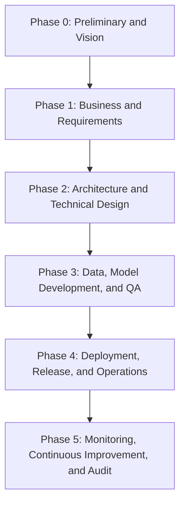

# ARGUS: Enterprise AI Project Runbook
## End-to-End Execution Playbook for Delivery, Deployment, and Operations

This runbook is the master execution guide for **Project ARGUS** (Identity Document Fraud Detection). It is designed to support the full project lifecycle from idea inception to production operations, including architecture, data pipelines, ML development, governance, deployment, monitoring, rollback, and incident response.

The delivery model combines:

- **TOGAF ADM** for enterprise architecture governance
- **Agile/Scrum** for iterative execution
- **MLOps** for reproducible experimentation, deployment, and monitoring
- **Security / Compliance by Design** for ISO/IEC 42001, EU AI Act, and GDPR alignment

---

## 1. Delivery Principles

The project must satisfy the following principles end to end:

1. **No phase proceeds without gated approval.**
2. **Every architecture decision is documented.**
3. **Every model is reproducible from data version to artifact hash.**
4. **Every release is reversible through validated rollback procedures.**
5. **Every production incident has an owner, severity, SLA, and communication path.**
6. **Compliance controls are implemented during design, not retrofitted after deployment.**

---

## 2. Lifecycle Overview

Each phase has:

- objective
- entry criteria
- activities
- deliverables
- ceremonies
- RACI ownership
- exit criteria
- checklist

---

## 3. Phase 0: Preliminary and Architecture Vision

### Objective
Establish scope, business value, governance model, stakeholders, success criteria, and target-state architecture.

### Inputs
- Competition guidelines
- Business opportunity statement
- Initial stakeholder list

### Activities
- Conduct kickoff workshop
- Identify in-scope and out-of-scope capabilities
- Define success metrics and constraints
- Draft project charter and architecture vision
- Establish governance bodies: ARB, product steering group, security/compliance review path

### Deliverables
- `docs/Phase-0/00_Project_Charter.md`
- `docs/Phase-0/01_Architecture_Vision.md`
- Initial stakeholder matrix
- RAID log (risks, assumptions, issues, dependencies)

### Ceremonies
- Project Kickoff
- Architecture Review Board (ARB) Vision Review

### RACI
- **Accountable**: AI Solution Architect
- **Responsible**: AI Solution Architect, Project Manager
- **Consulted**: Business Sponsor, Security Lead, Compliance Lead
- **Informed**: Development Team

### Entry Criteria
- Sponsor authorisation to initiate project

### Exit Criteria
- Signed project charter
- Approved architecture vision
- Stakeholder matrix reviewed
- Initial risks logged

### Checklist
- [ ] Stakeholder matrix mapped and validated
- [ ] Business drivers documented
- [ ] Success metrics defined
- [ ] Scope boundaries agreed
- [ ] Architecture vision approved by ARB
- [ ] RAID log created

---

## 4. Phase 1: Business and Requirements Definition

### Objective
Translate project vision into measurable functional, non-functional, operational, and compliance requirements.

### Inputs
- Approved Phase 0 deliverables

### Activities
- Conduct workshops with product, operations, and compliance stakeholders
- Write business process and use-case definitions
- Define user journeys and fraud scenarios
- Capture service-level objectives, latency, throughput, and availability targets
- Define explainability, auditability, and human-review requirements
- Create initial backlog in project management tooling

### Deliverables
- `docs/Phase-1/02_BRD.md`
- `docs/Phase-1/03_Use_Case_Specification.md`
- Initial product backlog
- Traceability matrix from business goals to system requirements

### Ceremonies
- Requirements Walkthrough
- Business Sign-Off Review

### RACI
- **Accountable**: Project Manager
- **Responsible**: Business Analyst, AI Solution Architect
- **Consulted**: Compliance Lead, Lead Data Scientist, Operations Lead
- **Informed**: Development Team

### Entry Criteria
- Phase 0 approved

### Exit Criteria
- BRD signed
- Use cases approved
- Product backlog prioritised
- NFRs baselined

### Checklist
- [ ] Functional requirements approved
- [ ] Non-functional requirements approved
- [ ] Compliance requirements documented
- [ ] Failure modes identified
- [ ] Backlog created and prioritised
- [ ] Requirement traceability matrix established

---

## 5. Phase 2: Architecture and Technical Design

### Objective
Define solution architecture, data architecture, deployment architecture, interfaces, technology choices, and design decisions.

### Inputs
- Approved BRD and use cases

### Activities
- Produce logical and physical architecture diagrams
- Select model strategy and inference topology
- Design training, validation, and inference pipelines
- Define API contracts and integration patterns
- Document architecture decisions in ADRs
- Define observability, secrets, IAM, and networking model
- Define environments: dev, test, staging, production

### Deliverables
- `docs/Phase-2/04_SAD.md`
- `docs/Phase-2/05_DAD.md`
- `docs/adr/`
- API contract specification
- Deployment topology diagram

### Ceremonies
- ARB Design Sign-Off
- Security Architecture Review

### RACI
- **Accountable**: AI Solution Architect
- **Responsible**: AI Solution Architect, Tech Lead
- **Consulted**: Infrastructure Lead, Security Lead, MLOps Engineer
- **Informed**: Entire Project Team

### Entry Criteria
- Phase 1 approved

### Exit Criteria
- SAD approved
- DAD approved
- Critical ADRs signed off
- Security architecture review completed

### Checklist
- [ ] Tech stack approved
- [ ] ADRs created for major decisions
- [ ] Data lineage defined
- [ ] API contracts validated
- [ ] Environment topology approved
- [ ] Security controls designed into architecture

---

## 6. Phase 3: Data, Model Development, and Quality Assurance

### Objective
Build the data pipeline, train and evaluate candidate models, harden the codebase, and verify quality gates.

### Inputs
- Approved SAD, DAD, and API contracts
- Provisioned development environment

### Workstreams

### 6.1 Data Engineering
- Build dataset ingestion workflow
- Verify source integrity and schema
- Strip EXIF and sensitive metadata
- Split train/validation/test data deterministically
- Implement augmentation pipeline
- Version processed datasets

### 6.2 ML Experimentation
- Implement baseline models
- Train and compare EVA-02-Large, ConvNeXt-V2-Base, EfficientNet-B4
- Track runs, metrics, and artifacts
- Tune hyperparameters
- Evaluate calibration, thresholding, and robustness

### 6.3 Software Engineering
- Build reusable training modules
- Expose inference service through FastAPI
- Add unit and integration tests
- Enforce linting, formatting, and typing

### 6.4 Quality Assurance
- Validate metrics against competition and production targets
- Run adversarial and recapture-specific test scenarios
- Test API performance, error handling, and schema conformance
- Run security scans on dependencies and images

### Deliverables
- `docs/Phase-3/06_ML_Design.md`
- `docs/Phase-3/07_Test_Strategy.md`
- `src/`
- trained model artifacts
- experiment registry entries
- CI/CD pipeline definitions

### Scrum Ceremonies
- Sprint Planning (2-week sprint cadence)
- Daily Standup (15 minutes)
- Backlog Refinement (weekly)
- Sprint Review and Demo (end of sprint)
- Sprint Retrospective (end of sprint)

### RACI
- **Accountable**: Tech Lead / Lead Data Scientist
- **Responsible**: Data Scientists, ML Engineers, Software Engineers
- **Consulted**: AI Solution Architect, Security Lead
- **Informed**: Project Manager, Business Sponsor

### Entry Criteria
- Phase 2 approved
- Environments provisioned
- Backlog ready for sprint execution

### Exit Criteria
- Reproducible training pipeline established
- Target validation metrics achieved or variance formally accepted
- All CI quality gates passing
- Test evidence archived

### Checklist
- [ ] Data ingestion pipeline implemented
- [ ] Data privacy controls verified
- [ ] Dataset versioning enabled
- [ ] Baseline and champion models compared
- [ ] Experiment tracking enabled
- [ ] Unit, integration, and performance tests passing
- [ ] Container image built and scanned
- [ ] Model card created

---

## 7. Phase 4: Deployment, Release, and Operations Readiness

### Objective
Prepare the system for production by validating infrastructure, deployment automation, security, release governance, and operational ownership.

### Inputs
- Validated model artifact
- Passing CI/CD pipeline
- Approved security and compliance controls

### Activities
- Build deployment manifests and infrastructure configuration
- Configure Kubernetes or container hosting environment
- Configure API gateway, ingress, auth, secrets, and TLS
- Set up monitoring dashboards and alerting rules
- Execute load, soak, and failover tests
- Validate blue-green deployment and rollback procedures
- Complete handover to operations team

### Deliverables
- `docs/Phase-4/08_Security_Compliance.md`
- `docs/Phase-4/09_Operations_Runbook.md`
- release package and deployment manifests
- dashboard and alert catalogue
- release readiness evidence pack

### Ceremony
- Release Readiness Review
- Go/No-Go Decision Board

### RACI
- **Accountable**: Operations Lead / Tech Lead
- **Responsible**: MLOps Engineer, DevOps Engineer, SRE
- **Consulted**: AI Solution Architect, Security Lead, Compliance Lead
- **Informed**: Business Sponsor, Project Manager

### Entry Criteria
- Phase 3 completed
- Production candidate artifact approved

### Exit Criteria
- Production deployment approved
- Monitoring active
- On-call ownership assigned
- Rollback validated
- Operational handover completed

### Checklist
- [ ] Threat model complete
- [ ] Vulnerability scan findings remediated or accepted
- [ ] Secrets management configured
- [ ] Blue-green deployment validated
- [ ] Automated rollback tested
- [ ] Runbook walkthrough completed with operations team
- [ ] Alerting thresholds approved
- [ ] Production support roster published

---

## 8. Phase 5: Monitoring, Continuous Improvement, and Audit

### Objective
Operate the production system safely while continuously improving model quality, reliability, compliance posture, and cost efficiency.

### Activities
- Monitor system health and business KPIs
- Monitor drift, calibration, and false-positive / false-negative rates
- Review incidents, near misses, and customer feedback
- Trigger retraining based on defined thresholds
- Maintain audit evidence for compliance reviews
- Refresh risk register and architecture decisions as needed

### Deliverables
- Monthly service review
- Model performance report
- Drift report
- Audit log archive
- Improvement backlog

### Ceremonies
- Weekly Operations Review
- Monthly Model Governance Review
- Quarterly Compliance Audit Review

### Exit Criteria
This phase does not exit; it is the steady-state operating mode until decommissioning.

### Checklist
- [ ] Availability and latency within SLO
- [ ] Drift thresholds continuously evaluated
- [ ] Incident review actions tracked to closure
- [ ] Audit evidence retained
- [ ] Retraining decisions documented
- [ ] Cost and capacity reviewed monthly

---

## 9. End-to-End Execution Workflow

### 9.1 Build Path from Scratch

1. Approve charter and architecture vision
2. Define and sign off requirements
3. Finalise architecture, data design, and ADRs
4. Provision environments and CI/CD
5. Ingest and validate dataset
6. Implement baseline and candidate models
7. Train, evaluate, and register models
8. Build inference API and container image
9. Validate quality, security, and performance
10. Deploy to staging
11. Execute UAT and release readiness checks
12. Deploy to production using blue-green strategy
13. Monitor, support, retrain, and audit continuously

### 9.2 Sprint-Level Delivery Flow

For every sprint:

1. Select backlog items with acceptance criteria
2. Decompose into architecture, data, ML, API, and test tasks
3. Implement and peer review code
4. Execute automated checks in CI
5. Demonstrate sprint output
6. Update architecture, ML, and operations documentation
7. Carry unresolved risks and technical debt into the next planning cycle

---

## 10. Environment Strategy

| Environment | Purpose | Data Policy | Release Rule |
|---|---|---|---|
| Dev | Local development and experimentation | Synthetic or approved non-production data | Continuous |
| Test | Integration and automated test execution | Sanitised validation data | On merge to main |
| Staging | Production-like validation and UAT | Approved masked / sanctioned data | Candidate release only |
| Production | Live inference service | Strict access-controlled production data | Go/No-Go approval required |

---

## 11. CI/CD Quality Gates

A change cannot be promoted unless all mandatory gates pass.

### Mandatory Gates
- Linting and formatting
- Unit tests
- Integration tests
- API contract tests
- Model evaluation threshold check
- Container build
- Dependency vulnerability scan
- Secret scan
- Infrastructure validation

### Promotion Rules
- **Dev to Test**: Merge to `main`
- **Test to Staging**: Release candidate tag + successful integration suite
- **Staging to Production**: Go/No-Go approval + signed evidence pack

---

## 12. Model Lifecycle Controls

### Model Registration Requirements
Every promoted model must include:

- model version
- git commit hash
- dataset version
- feature/preprocessing version
- hyperparameter configuration
- validation metrics
- threshold configuration
- container version
- approval record

### Champion-Challenger Pattern
- **Champion**: current production model
- **Challenger**: newly validated model under evaluation
- Challenger only replaces champion after approval from model governance review

### Retraining Triggers
Retraining is triggered if any of the following occur:

- drift exceeds approved threshold for 3 consecutive monitoring windows
- false positives increase by more than 15% over baseline for 7 consecutive days
- false negatives increase by more than 10% over baseline for 7 consecutive days
- source data characteristics materially change
- security or fraud threat landscape introduces a new dominant attack pattern

---

## 13. Monitoring and Alerting

### Golden Signals
- latency
- traffic
- error rate
- saturation

### ML Signals
- prediction confidence distribution
- class balance shift
- input quality degradation
- drift score
- fraud catch rate
- human review override rate

### Severity Levels

| Severity | Definition | Response Start | Update Frequency | Target Resolution |
|---|---|---|---|---|
| Sev 1 | Production outage, systemic fraud escape, or critical compliance breach | 15 min | 30 min | 4 hours |
| Sev 2 | Major degradation with material business impact | 30 min | 60 min | 8 hours |
| Sev 3 | Partial degradation or non-critical feature impact | 4 hours | Daily | 3 business days |
| Sev 4 | Low-risk issue or enhancement | Next business day | Weekly | Planned backlog |

### Alert Examples
- API p95 latency > 800 ms for 10 minutes
- HTTP error rate > 3% for 5 minutes
- CPU or memory saturation > 85% for 15 minutes
- drift score beyond control threshold for 3 scheduled evaluations
- fraud escape incidents above risk appetite threshold

---

## 14. Deployment and Rollback Procedure

### Blue-Green Deployment Steps
1. Build and sign production candidate image
2. Deploy to green environment
3. Run smoke tests and health probes
4. Run canary traffic at 5%
5. Observe latency, errors, and model outputs
6. Increase to 25%, then 50%, then 100% if stable
7. Keep blue environment warm until release closure window completes

### Rollback Triggers
Immediate rollback is required when any of the following occur:

- Sev 1 incident declared during release
- p95 latency exceeds 2x baseline for 15 minutes
- HTTP 5xx error rate exceeds 5% for 10 minutes
- fraud false-negative spike above approved threshold during canary
- critical security control failure or invalid auth behaviour observed

### Rollback Steps
1. Freeze further promotion activity
2. Route traffic back to blue environment
3. Confirm service health and baseline metrics recovery
4. Revoke candidate artifact from promotion path
5. Open incident record and assign incident commander
6. Complete root cause analysis within 2 business days

---

## 15. Incident Management

### Incident Roles
- **Incident Commander**: coordinates response
- **Technical Lead**: drives diagnosis and remediation
- **Communications Lead**: stakeholder and executive updates
- **Scribe**: timeline capture and action log
- **Security Lead**: required for data, fraud, or compliance incidents

### Incident Workflow
1. Detect incident from alert or human report
2. Classify severity
3. Assign commander and responders
4. Mitigate impact
5. Communicate status
6. Recover service
7. Perform post-incident review
8. Track corrective and preventive actions

### Mandatory Outputs
- incident ticket
- timeline
- root cause analysis
- corrective actions
- lessons learned

---

## 16. Security and Compliance Controls

### Security Controls
- RBAC with least privilege
- secrets managed outside code repository
- signed container images
- vulnerability scanning on dependencies and containers
- TLS for all ingress and service endpoints
- audit logging for administrative and deployment actions

### Data Protection Controls
- EXIF stripping during ingestion
- encryption at rest and in transit
- restricted access to datasets and model artifacts
- retention and deletion policy for temporary processing data
- dataset usage approval record

### AI Governance Controls
- model card for every production model
- human-review fallback for uncertain classifications
- traceability from requirement to deployed control
- documented risk acceptance decisions
- periodic compliance evidence review

---

## 17. Documentation Set Required for Full Execution

The project is not considered execution-ready unless the following documents exist and are current:

| Document | Purpose | Owner |
|---|---|---|
| `Phase-0/00_Project_Charter.md` | Scope, business case, constraints | Project Manager |
| `Phase-0/01_Architecture_Vision.md` | Target state and architecture vision | AI Solution Architect |
| `Phase-1/02_BRD.md` | Functional and non-functional requirements | Business Analyst |
| `Phase-1/03_Use_Case_Specification.md` | User stories, flows, failure modes | Product / Business Analyst |
| `Phase-2/04_SAD.md` | Solution architecture design | AI Solution Architect |
| `Phase-2/05_DAD.md` | Data design and lineage | Data Architect |
| `Phase-3/06_ML_Design.md` | Model design and experimentation plan | Lead Data Scientist |
| `Phase-3/07_Test_Strategy.md` | Testing approach and evidence requirements | QA Lead |
| `Phase-4/08_Security_Compliance.md` | Security and regulatory controls | Security / Compliance Lead |
| `Phase-4/09_Operations_Runbook.md` | Production operations and support procedures | Operations Lead |
| `10_Product_Backlog.md` | Prioritized backlog of user stories across phases | Product / Business Analyst |

---

## 18. Definition of Done by Milestone

### Architecture Done
- Approved charter, vision, BRD, SAD, DAD, and ADRs

### MVP Done
- Baseline model trained
- Inference API working
- CI/CD established
- Metrics dashboard available

### Production Ready Done
- Champion model approved
- Security review passed
- Rollback tested
- Operations handover complete
- Monitoring and alerting active

### Audit Ready Done
- Traceability complete
- Evidence archive current
- Compliance controls verified
- Incident and change logs retained

---

## 19. Minimum Templates to Create Immediately

The following files should be created first to enable project execution:

1. `docs/Phase-0/00_Project_Charter.md`
2. `docs/Phase-0/01_Architecture_Vision.md`
3. `docs/Phase-1/02_BRD.md`
4. `docs/Phase-2/04_SAD.md`
5. `docs/Phase-2/05_DAD.md`
6. `docs/Phase-3/06_ML_Design.md`
7. `docs/Phase-3/07_Test_Strategy.md`
8. `docs/Phase-4/08_Security_Compliance.md`
9. `docs/Phase-4/09_Operations_Runbook.md`
10. `docs/adr/ADR-001-template.md`

---

## 20. Final Execution Readiness Check

Before declaring the project end-to-end executable, confirm:

- [ ] Repo structure exists and matches README
- [ ] Setup script installs complete environment
- [ ] Dataset acquisition path is documented and tested
- [ ] Training pipeline runs from configuration without manual patching
- [ ] Inference service can start locally and in container
- [ ] CI/CD gates are configured and enforced
- [ ] Release, rollback, and incident procedures are tested
- [ ] Monitoring dashboards and alerts are live
- [ ] Security and compliance evidence is maintained
- [ ] Named owners exist for every critical operational responsibility

This runbook is complete when all sections above are implemented in repository artifacts and operational practice, not only documented.
