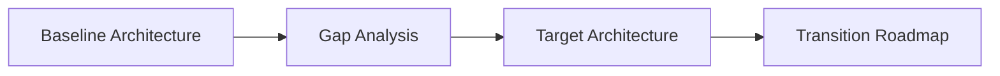

# ARGUS: Enterprise AI Project Runbook


This runbook serves as the master execution playbook for **Project ARGUS** (Identity Document Fraud Detection). It establishes the governance, architecture, and delivery frameworks required to take the AI solution from initiation through to production operations.

---

## Table of Contents
1. [Project Initiation & Stakeholder Management](#1-project-initiation--stakeholder-management)
2. [Business Requirements & Use Case Definition](#2-business-requirements--use-case-definition)
3. [Enterprise Architecture Assessment (TOGAF ADM)](#3-enterprise-architecture-assessment-togaf-adm)
4. [Solution Architecture & Tech Stack Selection](#4-solution-architecture--tech-stack-selection)
5. [AI, Data, & Integration Architecture](#5-ai-data--integration-architecture)
6. [Security, Privacy, Compliance & Governance](#6-security-privacy-compliance--governance)
7. [Risk Assessment & Mitigation Plan](#7-risk-assessment--mitigation-plan)
8. [Agile Delivery Plan & Sprint Structure](#8-agile-delivery-plan--sprint-structure)
9. [Development Standards & Quality Assurance](#9-development-standards--quality-assurance)
10. [Data Governance, Model Governance & MLOps](#10-data-governance-model-governance--mlops)
11. [Deployment, Rollback & Disaster Recovery](#11-deployment-rollback--disaster-recovery)
12. [Documentation & Knowledge Management](#12-documentation--knowledge-management)
13. [Operational Support & Incident Management](#13-operational-support--incident-management)
14. [KPIs, Success Metrics & ROI Measurement](#14-kpis-success-metrics--roi-measurement)

---

## 1. Project Initiation & Stakeholder Management

### Phase Overview
Defines the project charter, establishes the core team, identifies key stakeholders, and aligns expectations regarding business value, constraints, and success criteria.

*   **Objectives**: Formally authorize the project, align stakeholders, and establish the governance structure.
*   **Inputs**: Business Case Draft, Competition/Sponsor Guidelines (FREUID 2026), Enterprise Strategy.
*   **Activities**: Stakeholder mapping, kickoff meeting, drafting the Project Charter.
*   **Deliverables**: [Project Charter](01_BRD.md), Stakeholder Register, RACI Matrix.

### RACI Matrix
| Role | Sponsor | AI Solution Architect | Project Manager | Tech Lead | Lead Data Scientist | Security/Compliance |
|---|---|---|---|---|---|---|
| **Project Charter** | A | C | R | C | C | C |
| **Stakeholder Register**| C | C | R | I | I | I |
| **RACI Alignment** | A | R | R | C | C | C |

*R = Responsible, A = Accountable, C = Consulted, I = Informed*

### Entry and Exit Criteria
*   **Entry**: Sponsorship commitment and initial funding/resources allocated.
*   **Exit**: Signed Project Charter and approved Stakeholder Register.

### Risks & Mitigations
*   **Risk**: Misalignment on project scope between business sponsors and technical teams.
    *   *Mitigation*: Define explicit out-of-scope items in the Project Charter.

### Compliance & Quality Gates
*   **Compliance**: Ensure stakeholder identification complies with GDPR data privacy policies (no unauthorized PII in stakeholder registers).
*   **Quality Gate**: Charter must be signed off by both the Business Sponsor and the AI Solution Architect.

---

## 2. Business Requirements & Use Case Definition

### Phase Overview
Translates high-level business objectives into concrete functional and non-functional requirements, focusing on the specific challenges of identity document fraud detection.

*   **Objectives**: Define the business problem, target operating metrics, and system constraints.
*   **Inputs**: Project Charter, Industry benchmarks for KYC fraud rates.
*   **Activities**: Requirement workshops, user story mapping, SLA definition.
*   **Deliverables**: [Business Requirements Document (BRD)](01_BRD.md), Product Backlog (Epics).

### RACI Matrix
| Role | Business Analysts | AI Solution Architect | Project Manager | Lead Data Scientist | Compliance |
|---|---|---|---|---|---|
| **BRD** | R | C | A | C | C |
| **Backlog Epics** | R | C | A | C | I |

### Entry and Exit Criteria
*   **Entry**: Project Charter approved.
*   **Exit**: BRD signed off; Epics created in the project management tool.

### Risks & Mitigations
*   **Risk**: Setting unrealistic performance targets (e.g., 100% detection rate with 0% false positives).
    *   *Mitigation*: Educate business stakeholders on the ROC curve and establish the target operating point using the **APCER @ 1% BPCER** metric.

### Compliance & Quality Gates
*   **Compliance**: Verify that the requirements align with the **EU AI Act** classification for high-risk AI systems (Annex III - Biometrics and KYC verification).
*   **Quality Gate**: Non-functional requirements (NFRs) must include explicit latency, throughput, and explainability targets.

---

## 3. Enterprise Architecture Assessment (TOGAF ADM)

### Phase Overview
Evaluates the current state of the organization's technology landscape and designs the target architecture to support the new AI system, identifying gaps that must be addressed.



*   **Objectives**: Ensure alignment with enterprise IT standards and define the transition architecture.
*   **Inputs**: Enterprise IT Standards, Existing KYC pipeline documentation.
*   **Activities**: Gap analysis across Business, Data, Application, and Technology domains (TOGAF Phases B, C, D).
*   **Deliverables**: [Solution Architecture Document (SAD)](02_SAD.md), Gap Analysis Report.

### RACI Matrix
| Role | Enterprise Architect | AI Solution Architect | Tech Lead | Security Lead | Infrastructure Lead |
|---|---|---|---|---|---|
| **Domain Architecture**| C | R | C | C | C |
| **Gap Analysis** | A | R | R | C | C |
| **SAD** | A | R | C | C | C |

### Entry and Exit Criteria
*   **Entry**: BRD approved.
*   **Exit**: SAD approved by the Architecture Review Board (ARB).

### Risks & Mitigations
*   **Risk**: Incompatibility of target AI technologies with existing legacy core banking systems.
    *   *Mitigation*: Design a decoupled, API-first integration layer using asynchronous message queues.

### Compliance & Quality Gates
*   **Compliance**: Align data architecture designs with **ISO/IEC 27001** control objectives for data storage and segregation.
*   **Quality Gate**: Review and sign-off from the Enterprise Security Architect.

---

## 4. Solution Architecture & Tech Stack Selection

### Phase Overview
Selects the specific technology stack, frameworks, and infrastructure components required to build, deploy, and scale the AI solution.

*   **Objectives**: Establish a scalable, maintainable, and cost-effective technology stack.
*   **Inputs**: SAD, Cloud Service Provider (CSP) service catalog, budget constraints.
*   **Activities**: Technical spike evaluations, cost estimation modeling, ADR (Architecture Decision Record) drafting.
*   **Deliverables**: [Architecture Decision Records (ADRs)](adr/), Bill of Materials (BOM).

### Tech Stack Selection Matrix
| Layer | Technology | Decision Driver |
|---|---|---|
| **Deep Learning** | PyTorch 2.3 | Extensive support for Vision Transformers and custom loss formulations. |
| **Model Zoo** | `timm` + HuggingFace | Access to pre-trained state-of-the-art models (EVA-02, ConvNeXt). |
| **Augmentation** | Albumentations | Performance-optimized image transformations. |
| **Config Management**| Hydra | Hierarchical configuration management for reproducible training runs. |
| **Inference API** | FastAPI | Asynchronous performance, native OpenAPI generation. |
| **Orchestration** | Kubernetes (GKE) | Scalability, self-healing, and container orchestration. |

### Entry and Exit Criteria
*   **Entry**: Target architecture defined in the SAD.
*   **Exit**: Critical ADRs approved and signed off by the engineering team.

### Risks & Mitigations
*   **Risk**: Cloud vendor lock-in.
    *   *Mitigation*: Use containerized deployments (Docker/Kubernetes) and open-source ML frameworks to maintain cloud portability.

---

## 5. AI, Data, & Integration Architecture

### Phase Overview
Detailed design of the machine learning pipelines, data schemas, ingestion workflows, and API integration layers.

*   **Objectives**: Define how data flows through the system and how models are trained and integrated.
*   **Inputs**: Selected technology stack, raw dataset specifications.
*   **Activities**: Data pipeline mapping, API contract design (OpenAPI/Swagger), model training strategy formulation.
*   **Deliverables**: [Data Architecture Document (DAD)](03_DAD.md), OpenAPI Specifications.

### Data Flow Architecture
```
[Raw Image Ingestion] ──> [EXIF Strip & Resize] ──> [Albumentations Augmentation] ──> [Model Inference] ──> [Decision Post-processing]
```

### Entry and Exit Criteria
*   **Entry**: Tech stack finalized.
*   **Exit**: Data schemas and API contracts committed to the repository.

### Risks & Mitigations
*   **Risk**: Training data leakage (e.g., mixing training and validation splits during augmentation).
    *   *Mitigation*: Implement strict data partition isolation in the ingestion pipeline before any transformation occurs.

### Compliance & Quality Gates
*   **Compliance**: Ensure the data pipeline includes an automated mechanism to strip metadata (EXIF data) to comply with GDPR minimization principles.
*   **Quality Gate**: API contracts must pass automated linting checks.

---

## 6. Security, Privacy, Compliance & Governance

### Phase Overview
Establishes the security controls, privacy safeguards, and governance frameworks required to protect the system and comply with relevant regulations.

*   **Objectives**: Ensure the AI system is secure by design and compliant with global regulations.
*   **Inputs**: DAD, Enterprise Security Policies, Regulatory texts (EU AI Act, GDPR).
*   **Activities**: Threat modeling, compliance mapping, privacy impact assessment (PIA).
*   **Deliverables**: [Security & Compliance Document](05_Security.md), Threat Model Report.

### Regulatory Compliance Checklist
- [ ] **GDPR**: Implement data retention policies and "right to be forgotten" workflows for user images.
- [ ] **EU AI Act**: Document training dataset provenance, model lineage, and human-in-the-loop fallback mechanisms.
- [ ] **ISO/IEC 42001**: Establish an AI Management System (AIMS) log to track model versions and performance degradation.
- [ ] **OWASP Top 10 (AI)**: Implement safeguards against prompt injection (if LLMs are used) and membership inference attacks.

### Entry and Exit Criteria
*   **Entry**: Integration architecture finalized.
*   **Exit**: Signed-off Security Design Review.

### Risks & Mitigations
*   **Risk**: Adversarial evasion attacks (manipulating input images to bypass detection).
    *   *Mitigation*: Train models using adversarial robust training techniques and implement input validation checks.

---

## 7. Risk Assessment & Mitigation Plan

### Phase Overview
Identifies, analyzes, and plans mitigations for risks across the project lifecycle, including technical, operational, and business risks.

*   **Objectives**: Minimize the probability and impact of project failures.
*   **Inputs**: All preceding architectural and business documents.
*   **Activities**: Risk identification workshops, FMEA (Failure Mode and Effects Analysis).
*   **Deliverables**: Project Risk Register.

### Risk Register Matrix
| Risk ID | Description | Impact | Probability | Mitigation Strategy |
|---|---|---|---|---|
| **R-001** | Model performance degrades on unseen document types. | High | Medium | Implement out-of-distribution (OOD) detection; trigger human review for low-confidence predictions. |
| **R-002** | Training infrastructure costs exceed budget. | Medium | High | Utilize spot instances for training; implement strict resource limits on GKE. |
| **R-003** | Data poisoning during training. | High | Low | Restrict access to training data repositories using IAM and verify dataset checksums. |

### Entry and Exit Criteria
*   **Entry**: Project scope and architecture defined.
*   **Exit**: Risk Register baseline established and integrated into the project backlog.

---

## 8. Agile Delivery Plan & Sprint Structure

### Phase Overview
Defines the execution roadmap using Agile methodologies, establishing the sprint cadence, milestones, and release management procedures.

*   **Objectives**: Deliver working software incrementally and adapt to changing requirements.
*   **Inputs**: Product Backlog, Team velocity estimates.
*   **Activities**: Release planning, sprint mapping, capacity planning.
*   **Deliverables**: Release Roadmap, Sprint Cadence Guide.

### Sprint Cadence
*   **Sprint Duration**: 2 Weeks.
*   **Ceremonies**:
    *   *Sprint Planning*: First Monday of the sprint (2 hours).
    *   *Daily Standup*: Monday through Friday (15 minutes).
    *   *Sprint Review & Demo*: Last Friday of the sprint (1 hour).
    *   *Retrospective*: Last Friday of the sprint (1 hour).

### Key Milestones
1. **Milestone 1 (Sprint 2)**: Baseline model trained and evaluated on validation split.
2. **Milestone 2 (Sprint 4)**: Data preprocessing and training pipelines fully automated (CI/CD).
3. **Milestone 3 (Sprint 6)**: Ensemble inference pipeline integrated with the FastAPI service.
4. **Milestone 4 (Sprint 8)**: Production deployment and monitoring dashboard active.

---

## 9. Development Standards & Quality Assurance

### Phase Overview
Establishes the coding standards, testing frameworks, and quality gates required to maintain a high-quality codebase.

*   **Objectives**: Maintain code quality, ensure reproducibility, and minimize technical debt.
*   **Inputs**: Coding guidelines, industry best practices.
*   **Activities**: Code reviews, automated testing, static analysis.
*   **Deliverables**: [Test Strategy Document](06_Test_Strategy.md), CI/CD Pipeline Configuration.

### Testing Strategy
```
[Unit Tests (PyTest)] ──> [Integration Tests (Data Pipeline)] ──> [Regression Tests (Model Performance)]
```

*   **Unit Testing**: Target >80% coverage on helper functions and data loaders using `pytest`.
*   **Model Validation**: Verify that new models do not degrade performance on the golden evaluation dataset.
*   **CI/CD Quality Gate**:
    *   Linting: `ruff` and `black`.
    *   Security Scanning: `bandit` for Python security checks.
    *   Type Checking: `mypy` for static type verification.

---

## 10. Data Governance, Model Governance & MLOps

### Phase Overview
Defines the operational processes for managing data quality, model lineage, deployment automation, and system monitoring.

*   **Objectives**: Ensure reliability, reproducibility, and compliance of the AI system in production.
*   **Inputs**: Compliance requirements, architectural designs.
*   **Activities**: MLOps pipeline setup, monitoring configuration.
*   **Deliverables**: MLOps Architecture Diagram, Model Registry Guide.

### MLOps Pipeline Components
1. **Data Versioning**: DVC (Data Version Control) integrated with object storage.
2. **Experiment Tracking**: MLflow for tracking parameters, metrics, and model artifacts.
3. **Model Registry**: MLflow Model Registry for managing model states (Staging, Production, Archived).
4. **Observability**: Prometheus and Grafana for system metrics; custom logging for model drift.

### Model Drift Monitoring
*   **Data Drift**: Monitor changes in input image properties (e.g., resolution, aspect ratio, noise distribution) using Kolmogorov-Smirnov tests.
*   **Concept Drift**: Track prediction confidence distributions over time. Significant shifts trigger automated alerts.

---

## 11. Deployment, Rollback & Disaster Recovery

### Phase Overview
Outlines the strategies for deploying the application to production, rolling back in the event of failures, and recovering from disasters.

*   **Objectives**: Minimize downtime and ensure business continuity during deployments and outages.
*   **Inputs**: Production infrastructure specifications, SLA requirements.
*   **Activities**: Deployment orchestration, disaster recovery testing.
*   **Deliverables**: Deployment Manifests, Disaster Recovery (DR) Plan.

### Deployment Strategy
We utilize a **Blue-Green Deployment** strategy to ensure zero-downtime updates:

```
[Traffic Router]
       │
       ├───> [Green Environment (Active Production - v1.0.0)]
       │
       └───> [Blue Environment (Staging / New Release - v1.1.0)] (Testing Phase)
```

1. Deploy the new version to the inactive (Blue) environment.
2. Run automated smoke tests against the Blue environment.
3. Route 100% of production traffic to the Blue environment.
4. Keep the Green environment active for 24 hours to facilitate rapid rollback if needed.

### Rollback Trigger Criteria
*   Inference error rate exceeds 1% over a 5-minute window.
*   P99 latency exceeds 500ms.
*   Memory or CPU usage triggers container restart loops.

---

## 12. Documentation & Knowledge Management

### Phase Overview
Establishes the standards for documenting the codebase, system architecture, and operational procedures to ensure knowledge retention.

*   **Objectives**: Enable seamless onboarding, troubleshooting, and long-term maintenance.
*   **Inputs**: Repository structure, team workflow preferences.
*   **Activities**: Document drafting, wiki maintenance.
*   **Deliverables**: Documentation Template, API Reference Docs.

### Documentation Requirements
*   **Code Documentation**: Inline docstrings following the Google Python Style Guide.
*   **Architecture Decisions**: All non-trivial technical choices must be documented as ADRs in `docs/adr/`.
*   **Operational Runbooks**: Clear step-by-step guides for common operational tasks (e.g., manual model retraining, rotating API keys).

---

## 13. Operational Support & Incident Management

### Phase Overview
Defines the support model, on-call rotations, and incident response procedures for the production system.

*   **Objectives**: Resolve production incidents rapidly and minimize business impact.
*   **Inputs**: SLAs, escalation paths.
*   **Activities**: Incident response training, post-mortem reviews.
*   **Deliverables**: Incident Response Playbook, On-Call Schedule.

### Incident Severity Levels
| Severity | Description | Target Response Time | Target Resolution Time |
|---|---|---|---|
| **L1 (Critical)** | Entire KYC pipeline is down; no fraud checks can be processed. | <15 minutes | <2 hours |
| **L2 (Major)** | System is operational but experiencing degraded performance (high latency). | <30 minutes | <8 hours |
| **L3 (Minor)** | Non-blocking issue; minor bug in reporting or monitoring dashboard. | <4 hours | <3 business days |

---

## 14. KPIs, Success Metrics & ROI Measurement

### Phase Overview
Defines the metrics used to measure the business value, technical performance, and operational efficiency of the AI system.

*   **Objectives**: Demonstrate value to stakeholders and guide continuous improvement efforts.
*   **Inputs**: Business goals, system performance data.
*   **Activities**: Metric tracking, ROI calculation.
*   **Deliverables**: Value Realization Dashboard, Quarterly Performance Report.

### Key Performance Indicators (KPIs)
*   **Business KPIs**:
    *   *Fraud Detection Rate*: Percentage of fraudulent documents correctly blocked.
    *   *Manual Review Rate*: Percentage of documents flagged for manual auditor review.
*   **Technical KPIs**:
    *   *APCER @ 1% BPCER*: Primary model performance metric.
    *   *Inference Latency*: End-to-end processing time per image (target < 200ms).
*   **Financial KPIs**:
    *   *Cost per Transaction*: Total infrastructure cost divided by the number of processed documents.
    *   *Fraud Losses Prevented*: Estimated monetary value of fraud blocked by the system.
